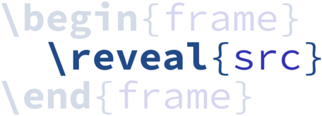

<p align="center">
    
    <br />
    Reveal source code line-by-line in LaTeX presentations.
</p>


## Install

* Copy [`reveal.py`](reveal.py) and [`reveal.tex`](reveal.tex) into your project.
* Make sure you have [pygments](http://pygments.org/) installed with `pip install Pygments`.

## Setup

Generate yourself style macros with

```
./reveal.py --style paraiso-dark style --output syntax.tex
```

Here we've chosen the `paraiso-dark` style, but you can choose anything
supported by pygments. See `pygmentize -L styles` for the full list.

Include the syntax macros and `reveal` headers in your LaTeX document with

```tex
\input{reveal.tex}
\input{syntax.tex}
```

## Including Source Code

Reveal understands special comments in source code at the end of each line,
starting with the prefix `//r`. The following example shows a "Hello World"
program in Go with reveal markup.

```go
package main

import "fmt" //r stage=1,2 inline:2="Provides formatting functions"

func main() {
	fmt.Println("Hello World!") //r stage=1,3 inline:3="To stdout"
}

```

This markup specifies:

* There are three _stages_. The first is implicit, and displays all lines.
* The `import` line will be highlighted in stage 2.
* The `fmt.Println` line will be highlighted in stage 3.
* These lines also have inline comments specified for stages 2 and 3.

To process this into LaTeX we use

```
./reveal.py generate --input samples/hello.go
```

Now include this code in slides with

```tex
\reveal{samples/hello.go}
```

The result is the following three slides.

<p align="center"></p>
<p align="center"></p>
<p align="center"></p>

## Snippets

It can sometimes be useful to present pieces of a larger file. `reveal`
supports this through \emph{snippets}. In a `reveal` comment an uppercase word
is interpreted as a snippet name. For example the following code has three snippets `TYPE`, `WRITETO` and `MAIN`.

```go
package main

import (
	"fmt"
	"io"
	"log"
	"os"
)

// Greeting represents a polite word or sign //r TYPE
// of welcome or recognition. //r TYPE
type Greeting struct { //r TYPE
	Salutation string //r TYPE stage=1,2 inline:2="Example: \"Hi\""
	Who        string //r TYPE stage=1,3 inline:3="Greeting recipient"
} //r TYPE

// WriteTo writes the greeting to w. //r WRITETO
func (g Greeting) WriteTo(w io.Writer) (int64, error) { //r WRITETO
	n, err := fmt.Fprintf(w, "%s, %s!\n", //r WRITETO
		g.Salutation, g.Who) //r WRITETO
	return int64(n), err //r WRITETO stage=1,2 inline:2="Why int64?"
} //r WRITETO

func main() { //r MAIN
	g := Greeting{ //r MAIN
		Salutation: "Hello", //r MAIN stage=1,3 inline:3="So configurable"
		Who:        "World", //r MAIN stage=1,3 inline:3="Much wow"
	} //r MAIN
	if _, err := g.WriteTo(os.Stdout); err != nil { //r MAIN
		log.Fatal(err) //r MAIN stage=1,2 inline:2="Always handle errors"
	} //r MAIN
} //r MAIN

```

Snippets can then be included by name.

```tex
\revealsnippet{samples/greet.go}{main}
```

This produces frames:

<p align="center"></p>
<p align="center"></p>
<p align="center"></p>
